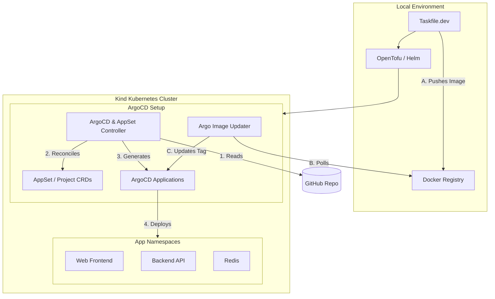

# Webchat GitOps (Kind + ArgoCD + OpenTofu)

A real-time communication platform utilizing a Python (FastAPI) backend and a static/Nginx frontend, orchestrated following GitOps practices via ArgoCD and OpenTofu in a Kind-based local Kubernetes environment.

This project demonstrates a fully automated workflow:
- Build → Push → GitOps → Deploy
- Fully local (Kind + local registry)
- Dynamic multi-app deployment using ArgoCD ApplicationSet
- Kustomize-based or pure manifests apps
- Real-time WebSocket chat backed by Redis Pub/Sub

---

## ✨ Features

- Multi-application GitOps using **ApplicationSet** with directory generator
- Local registry integration with Kind
- FastAPI WebSocket backend + Redis Pub/Sub
- Nginx frontend serving static assets
- Taskfile-based automation (build, push, apply)
- **Argo CD Image Updater** integration:
  - Updates container images in-place without Git write-back
  - Fully reproducible for local development
  - Works with Kustomize-based apps
  - Configured to always pick the newest build

---

## 🏗 Architecture


---

## 🔧 Prerequisites
- [go-task](https://taskfile.dev/docs/installation)
- [Docker](https://docs.docker.com/engine/install/)
- [kind](https://kind.sigs.k8s.io/docs/user/quick-start/#installation)
- [kubectl](https://kubernetes.io/docs/tasks/tools/)
- [OpenTofu](https://opentofu.org/docs/intro/install/) (open source Terraform alternative)

---

## 🚀 Setup

### Setup everything

```bash
task setup
```

This will:
- Create a Kind cluster and local registry
- Install ArgoCD and Argo CD Image Updater
- Apply GitOps configuration
- Build & push backend and frontend images

---

### Destroy everything

```bash
task teardown
```

---

## 💬 Application

- WebSocket endpoint: `/chat/ws`
- Real-time chat messages broadcast via Pub/Sub
- Frontend served on Nginx
- Backend served with FastAPI

---

## 🧪 Development Workflow

```bash
# Make changes to backend or frontend
task backend:push
# or
task web:push
# or
task push-all

# ArgoCD ApplicationSet auto-syncs
# Image Updater automatically updates Deployment images
```

No manual `kubectl apply` required. The system handles namespace creation, image updates, and application deployment automatically.

---

## 📝 Considerations
- In a production scenario, the git writeback method for argo image updater should be chosen for visibility and more reliable GitOps setup. The argo method was chosen to enable local development, without the need to push anything to git
- This project is structered as a monorepo. The application code, IaC and GitOps setup is all contained here. In a production environment these components should be decoupled for beter maintainability and more flexible deployment process
